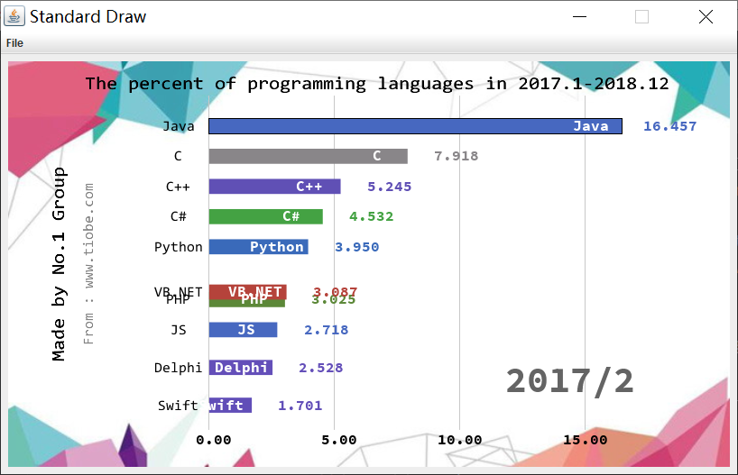

# Data-Visualization  
SUSTech CS102A Autumn2018, final term project  
## 南科大课程 CS102A 计算机程序设计A 期末Project作业
该项目为小组作业，共三部分，此为第三部分，本人负责。  
### Project 要求
传入文本文件，根据读取的数据生成动画。  
除"data"栏外，需要的数据文本中未包含则使用自定义默认值。
### 程序说明
本程序从命令行传入参数 ["txt/17-18.program_languages.txt"](https://github.com/CatFood-is-CatFood/Data-Visualization/tree/master/txt/17-18.program_languages.txt), 生成 2017.1-2018.12 共24个月的“世界编程语言使用人数前十排行”数据的展示动画。  
数据来源为 <https://www.tiobe.com>, 背景音乐为久石让的《Summer》, 背景图来自网络。
### 运行截图
